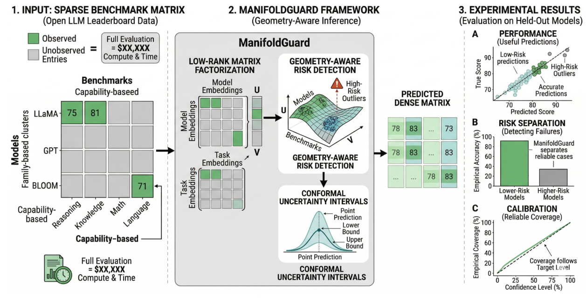
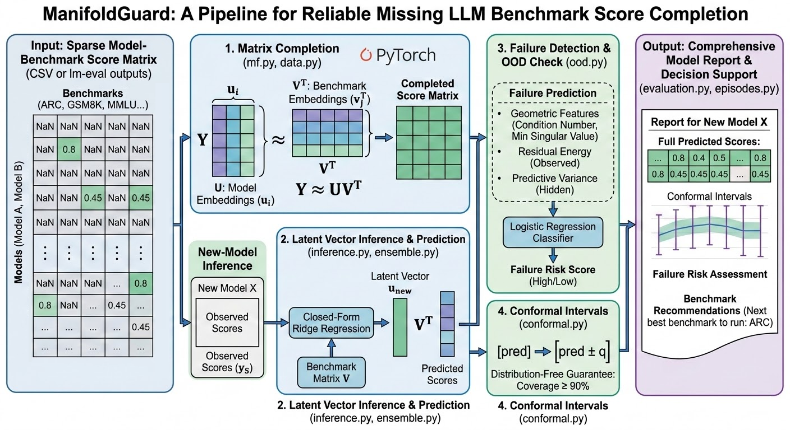
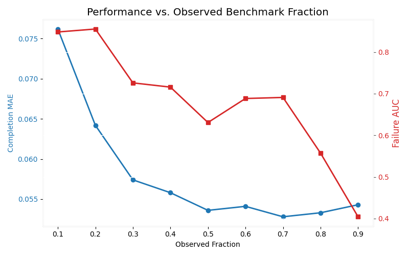
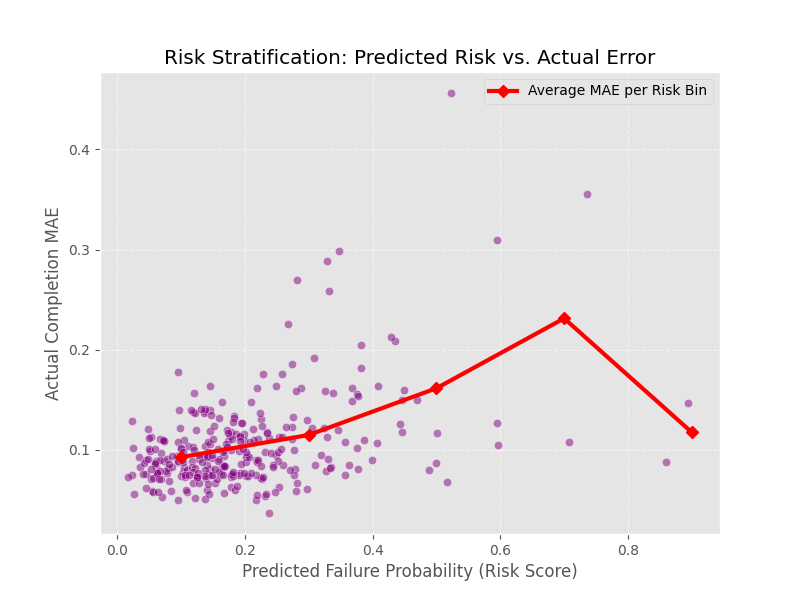
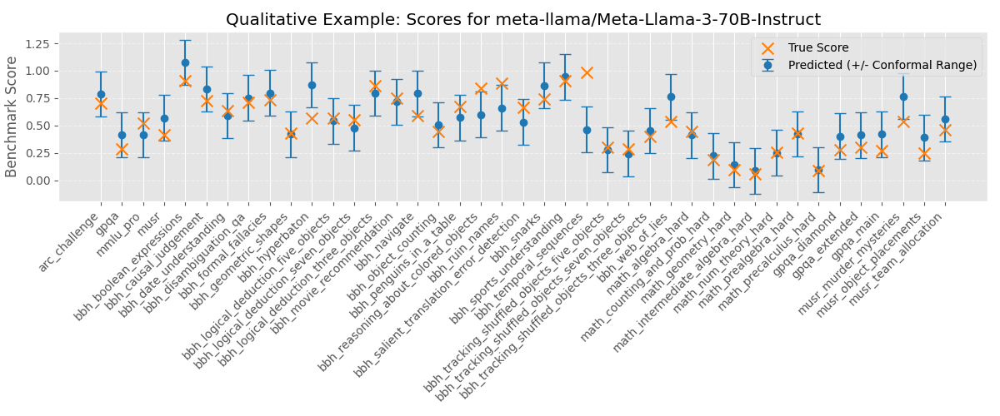
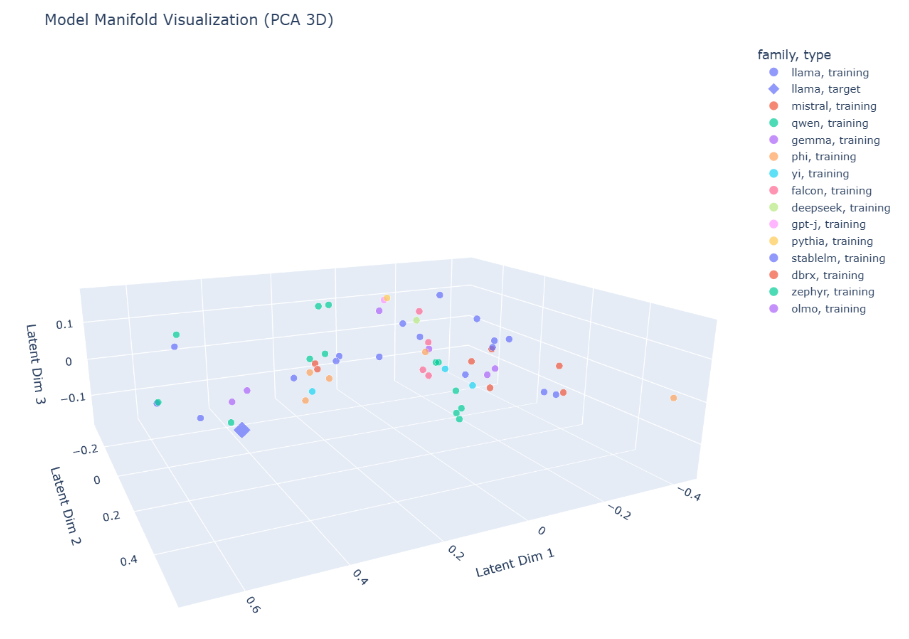

# Abstract

Evaluating large language models across many benchmarks is expensive and time-consuming. This project studies whether the remaining benchmark scores of a partially evaluated model can be predicted from only a subset of observed results. We present ManifoldGuard, a framework that combines low-rank matrix factorization, geometry-aware risk detection, and conformal uncertainty intervals to estimate missing benchmark scores while also identifying when those predictions are likely to fail. Using a real benchmark matrix built from Open LLM Leaderboard results, we evaluate the system on held-out models under both random and family-based splits. Our results show that ManifoldGuard can produce useful benchmark predictions from partial observations, separate lower-risk from higher-risk cases, and provide uncertainty estimates with empirical coverage close to the target level. These findings suggest that risk-aware benchmark completion can reduce evaluation cost while preserving reliability.

# Question I.
Can the remaining benchmark scores of a partially evaluated large language model be predicted accurately from a subset of observed benchmarks, while also identifying when those predictions are likely to be unreliable?
   
## Hypothesis:
If benchmark score patterns across language models follow a learnable low-rank structure, then a system using partial benchmark observations will be able to predict the remaining scores with useful accuracy. Furthermore, if reliability features such as residual error, predictive variance, and observation geometry are incorporated, then the system will also be able to distinguish lower-risk predictions from higher-risk ones and provide uncertainty intervals with empirical coverage close to the target level.

# Question II.
Can partial benchmark results be used to predict the rest of an LLM evaluation suite, and can we tell when those predictions should not be trusted?

## Hypothesis:
We hypothesize that partial benchmark observations contain enough structure to predict missing scores, and that adding geometry-aware risk detection and conformal uncertainty will make those predictions more reliable and actionable than plain score completion alone.

# Background Research
Large language models are typically evaluated using benchmark suites designed to measure reasoning, knowledge, instruction following, and related capabilities. As these suites grow, full evaluation becomes increasingly expensive in time and compute, creating pressure for methods that can make use of partial benchmark information rather than requiring every score to be measured directly *(Liang et al., 2022; Srivastava et al., 2023)*.
A natural way to represent this setting is as a matrix where rows correspond to models, columns correspond to benchmarks, and each entry is a benchmark score. When some entries are missing, matrix factorization provides a principled way to estimate them by learning a lower-dimensional latent structure that explains the observed performance patterns *(Koren, Bell, & Volinsky, 2009)*. This makes matrix completion a useful starting point for benchmark forecasting.
However, predictive accuracy alone is not sufficient in real evaluation workflows. A system that fills in missing benchmark scores must also indicate when its predictions are likely to be unreliable. This is why uncertainty quantification and calibration are important. Conformal prediction offers a distribution-free framework for constructing intervals with measurable coverage guarantees under appropriate assumptions *(Vovk, Gammerman, & Shafer, 2005; Angelopoulos & Bates, 2023)*. ManifoldGuard builds on these ideas by combining matrix completion with geometry-aware risk detection and conformal uncertainty estimation, making partial benchmark evidence more actionable in practice.

# Results

## Completion MAE and Failure AUC vs. Observed Benchmark Fraction

## Actual Completion MAE vs Predicted Failure Probability (Risk)

## Demo run for Meta-Llama-3-70B-Instruct

## Model Geometry Visualization (PCA Decomposition to 3-Space)

# Future Work

There are several directions to extend this work. First, the system should be tested on larger and more diverse benchmark datasets with more models, tasks, and stronger distribution shifts. While current results are promising, broader evaluation would better show how well the method generalizes in realistic settings, especially under harder out-of-distribution splits.

Second, the reliability component could be further improved. Although the current approach uses residual, variance, and geometry-based features, more advanced methods could better separate trustworthy from unreliable predictions. Future work could explore richer diagnostics, alternative uncertainty estimates, and stronger calibration, as well as how the system adapts to changing or new benchmarks.

Third, the system could evolve into a more active evaluation framework. Instead of only predicting missing scores, it could recommend the most informative next benchmarks, estimate the value of additional evaluation, and determine when enough evidence has been collected.

Finally, improving usability would make the framework more practical. ManifoldGuard could be developed into a lightweight tool or dashboard that lets users input partial results and receive predictions, uncertainty estimates, risk insights, and evaluation guidance for real-world use.

# Conclusions

This project explored whether missing benchmark scores for a partially evaluated large language model can be estimated from a subset of observed results.

The findings show this is possible using a low-rank latent structure, but also emphasize that prediction alone is not enough, systems must assess when estimates are unreliable. ManifoldGuard addresses this by combining benchmark completion with risk detection and uncertainty estimation.

Results show the method can produce useful estimates, distinguish between lower- and higher-risk predictions, and maintain reliable uncertainty coverage. Geometry-based features further improve the detection of unreliable predictions, highlighting the importance of data structure.

Overall, the work demonstrates that partial benchmark data becomes far more useful when prediction, uncertainty, and reliability are handled together, enabling more efficient evaluation without requiring a full benchmark suite upfront.

# References

Open LLM Leaderboard Team. (2024). Open LLM Leaderboard v2. Hugging Face. https://huggingface.co/spaces/open-llm-leaderboard/open_llm_leaderboard

Open LLM Leaderboard Team. (2025). open-llm-leaderboard/results dataset. Hugging Face. https://huggingface.co/datasets/open-llm-leaderboard/results

EleutherAI. (2025). Language Model Evaluation Harness. GitHub. https://github.com/EleutherAI/lm-evaluation-harness

Koren, Y., Bell, R., & Volinsky, C. (2009). Matrix Factorization Techniques for Recommender Systems. Computer, 42(8), 30-37. https://ieeexplore.ieee.org/document/5197422

Angelopoulos, A. N., & Bates, S. (2023). Conformal Prediction: A Gentle Introduction. Foundations and Trends in Machine Learning. https://arxiv.org/abs/2107.07511
Vovk, V., Gammerman, A., & Shafer, G. (2005). Algorithmic Learning in a Random World. Springer. https://link.springer.com/book/10.1007/b106715

Bommasani, R., et al. (2023). Holistic Evaluation of Language Models. TMLR. https://arxiv.org/abs/2211.09110

Srivastava, A., et al. (2023). Beyond the Imitation Game: Quantifying and Extrapolating the Capabilities of Language Models. TMLR. https://arxiv.org/abs/2206.04615
Clark, P., Cowhey, I., Etzioni, O., Khot, T., Sabharwal, A., Schoenick, C., & Tafjord, O. (2018). Think You Have Solved Question Answering? Try ARC, the AI2 Reasoning Challenge. https://arxiv.org/abs/1803.05457

Suzgun, M., Scales, N., Schärli, N., Gehrmann, S., Tay, Y., Chung, H. W., Chowdhery, A., Le, Q. V., Chi, E. H., Zhou, D., & Wei, J. (2022). Challenging BIG-Bench Tasks and Whether Chain-of-Thought Can Solve Them. https://arxiv.org/abs/2210.09261

Rein, D., Hou, B. L., Stickland, A. C., Petty, J., Pang, R. Y., Dirani, J., Michael, J., & Bowman, S. R. (2023). GPQA: A Graduate-Level Google-Proof Q&A Benchmark. https://arxiv.org/abs/2311.12022
Zhou, J., Lu, T., Mishra, S., Brahma, S., Basu, S., Luan, Y., Zhou, D., & Hou, L. (2023). Instruction-Following Evaluation for Large Language Models. https://arxiv.org/abs/2311.07911
Hendrycks, D., Burns, C., Kadavath, S., Arora, A., Basart, S., Tang, E., Song, D., & Steinhardt, J. (2021). Measuring Mathematical Problem Solving With the MATH Dataset. https://arxiv.org/abs/2103.03874

Wang, Y., Ma, X., Zhang, G., Ni, Y., Chandra, A., Guo, S., Ren, W., Arulraj, A., He, X., Jiang, Z., Li, T., Ku, M., Wang, K., Zhuang, A., Fan, R., Yue, X., & Chen, W. (2024). MMLU-Pro: A More Robust and Challenging Multi-Task Language Understanding Benchmark. https://arxiv.org/abs/2406.01574
Sprague, Z., Ye, X., Bostrom, K., Chaudhuri, S., & Durrett, G. (2023). MuSR: Testing the Limits of Chain-of-Thought with Multistep Soft Reasoning. https://arxiv.org/abs/2310.16049
